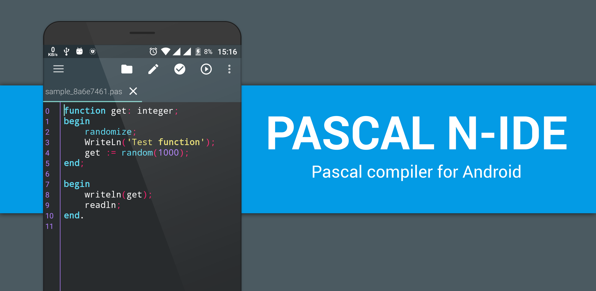

# Pascal NIDE - Pascal Compiler for Android



See app on Google Play Store

<a href="https://play.google.com/store/apps/details?id=com.duy.pascal.compiler">

</a>

## Overview

The application is a Pascal interpreter on Android. This application is confusing for everyone to learn Pascal on the mobile without a computer, so that we can practice anytime, anywhere.

## The main features of the IDE:

  1. Compile Pascal programs and run them without Internet.
  2. Report error when compiling
  3. Powerful editor with many smart features: 
	    * File menu: create a new program file, open, save,automatically save file
	    * Menu edit: Undo, redo, copy, paste.
	    * Auto suggest: Display a small popup window that suggests words that coincide with the word being typed
	    * Auto format: automatically reformat the code for easier viewing.
	    * Find / Find and replace: Regular Expression support.
	    * Goto line: Move the cursor to a line.
	    * Highlight code: highlight the keywords.
	    * Code style: many interface for the editor.
	    * Font size, font, word wrap.
  4. Support library Android (Sensor, battery, record audio, camera...)
  5. Support Java in Pascal

## Features that the interpreter is missing

- Exceptions
- Variant types
- goto, label
	
## Libraries supported for Android

- The **aTTSpeech** library converts text to speech (requires TextToSpeech). See example `text_to_speech.pas`
- The **aRecognition** library converts speech to text (requires Google Voice). See example `speech_to_text.pas`.
- The **aVibrate** library supports vibration control. You see example `vibrate.pas`
- The **aSensor** library supports processing of Android sensors (light, acceleration, ...). See `accelerometer_sensor.pas` for accelerometer sensor example
- The **aNotify** library helps display notifications in the status bar. See the example `notify.pas`
- The **aClipboard** library works with the clipboard in Android. See the `clipboard.pas` example
- The **aBattery** library retrieves the battery information of the device. See `battery.pas` example
- The **aMedia** library Provides classes that manage various media interfaces in audio and video. See [Wiki](wiki/library_document/aMedia_library.md)
- The **aTone** library provides API to play DTMF tones (ITU-T Recommendation Q.23). See [Wiki](wiki/library_document/aTone_library.md)
- The **aDilaog** library provides API to show some dialog. See [Wiki](wiki/library_document/aAialog_library.md)

### Java under Pascal - JPascal

Pascal N-IDE allows write program with objects class of ``Java``, which seems crazy :), but it is possible. I reprogrammed a whole platform. Therefore, you can completely use the ``class`` of ``Java`` (such as ``java.util.ArrayList`` or ``java.net.Socket`` to program Socket). That's great, isn't it?.

For more information, please read the ``java_under_pascal.md`` wiki for details.
[Link instruction](wiki/java_under_pascal/create_new_object.md)

Here is an example of using ``Socket``

```pascal
var
    sk: java_net_Socket;
    ipAddress: string;
    Port: integer;

begin
    ipaddress := '192.168.1.1';
    port := 80;

    {Socket sk = new Socket(ipAddress, port)}
    New(sk, ipAddress, port);

    writeln(sk);
    writeln(sk.isConnected());
end.
```

or ``ArrayList`` in ``Java``

```pascal
var
    list: java_util_ArrayList;
    i: integer;
begin
    new(list);

    for i := 1 to 10 do
        list.add(i);

    for i := 1 to 10 do
        writeln(list.get(i));

end.
```

## How to contribute
All contributions are welcome, include code, documentation, suggestions, bug reports, ... . Use github pull request feature or email me. Many thanks for your help
## Tutorials

1. [Google Voice](wiki/tutorials/vi/google_voice/google_voice.md)
2. [Scan Barcode/QR code](wiki/tutorials/vi/google_voice/scan_bar_code.md)
3. [Text To Speech](wiki/tutorials/vi/google_voice/text_to_speech.md)
4. [Generate Tone DFMT](wiki/tutorials/vi/google_voice/how_to_make_dtmf_tone.md)
5. [RGB Color](wiki/tutorials/vi/color/color.md)

See in https://pascalnide.wordpress.com/
  1. <a href="https://pascalnide.wordpress.com/2017/05/01/tao-ung-dung-giao-tiep-bang-giong-noi-voi-pascal-n-ide/">How to create communication application by voice with Pascal N-IDE></a>

If you want to help me write a tutorial, please email to me.

## License
	The code in this repository is licensed under the Apache License, Version 2.0 (the "License");
	you may not use this file except in compliance with the License.
	You may obtain a copy of the License at

	   http://www.apache.org/licenses/LICENSE-2.0

	Unless required by applicable law or agreed to in writing, software
	distributed under the License is distributed on an "AS IS" BASIS,
	WITHOUT WARRANTIES OR CONDITIONS OF ANY KIND, either express or implied.
	See the License for the specific language governing permissions and
	limitations under the License.
**NOTE**: This software depends on other packages that may be licensed under different open source licenses.

## Developer
 Trần Lê Duy
 
## Third party library
   * JSPIIJ https://github.com/jeremysalwen/JSPIIJ
   * SL4A https://github.com/damonkohler/sl4a
   * ZXing-android-embedded
