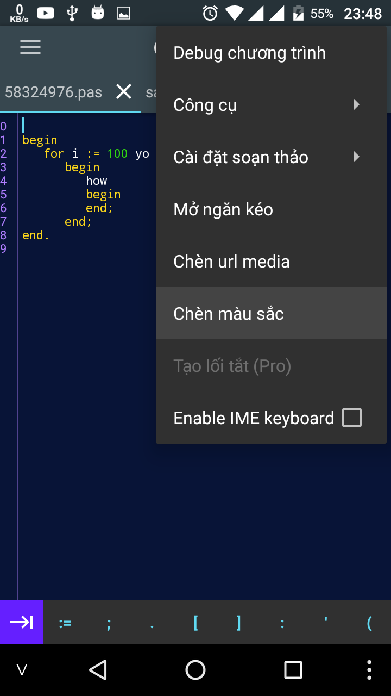
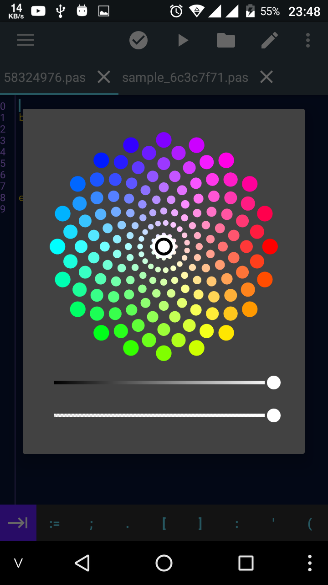
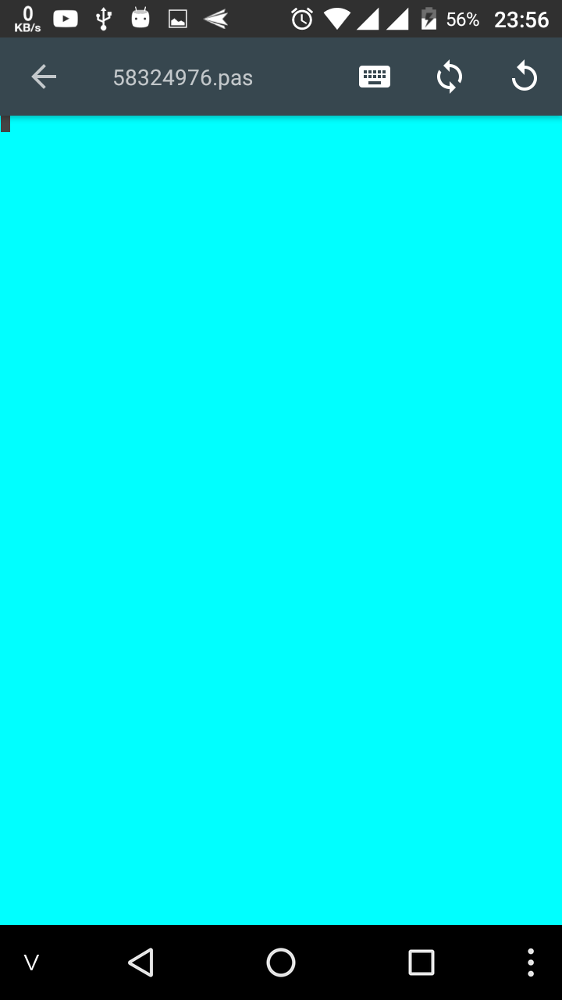
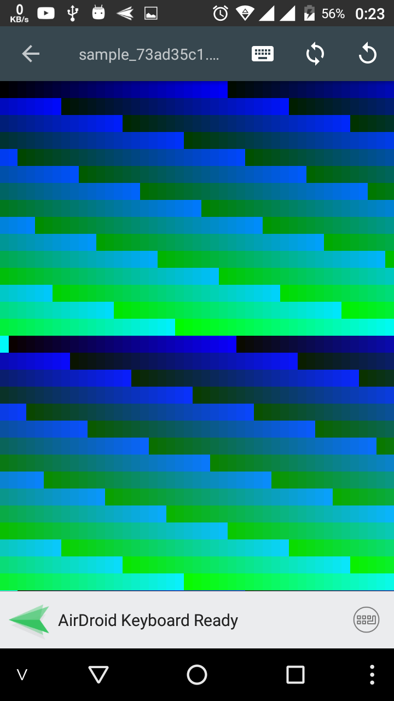
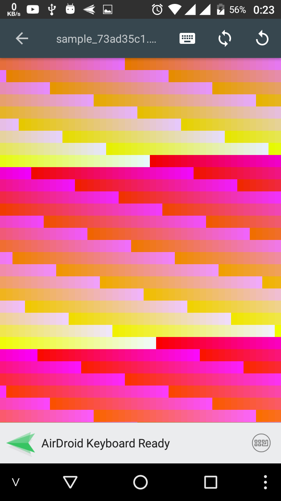

# Sử dụng 16 triệu màu trong Pascal

## Giới thiệu
Ví dụ này sẽ cho bạn thấy làm thế nào để sử dụng được 16 triệu màu thay vì sử dụng chỉ 15 màu trong Pascal. Nghe thật hấp dẫn phải không nào.

## Yêu cầu
- Phiên bản mới nhất của Pascal N-IDE
- Hết rồi

## Giới thiệu một chút về màu sắc trong lập trình

### Mã màu ``hex`` (được biểu diễn bằng kiểu ``string``)

Cấu trúc: ``#RRGGBB``

Trong đó

* Ký hiệu RR(red): biểu hiện màu đỏ
* Ký hiệu GG( green): biểu hiện màu xang lá cây
* Ký hiệu BB(blue): biẻu hiện màu xanh dương.

Thông sô của các giá trị màu sắc sẽ giao động trong khoảng 0 đến 255, cường độ của màu sắc sẽ tăng dần.

### Mã màu RGB (được biểu diễn bằng kiểu ``integer``)

Cấu trúc: ``rgb(red, green, blue)``.

Ví dụ:

``rgb(255, 0, 0)``: Khi bạn thực hiện cấu trúc này gía trị của màu xanh lá cây hay xanh dương đều bằng 0

``rgb(255, 255, 255)``: Khi bạn kết hợp 3 màu sắc là đỏ, xanh dương và xanh lá cây bạn sẽ được màu trắng.

### Công cụ lợi hại hơn

Nếu bạn cảm thấy khó khăn trong việc tạo ra màu sắc đúng ý của mình thì có thể sử dụng một công cụ được cung cấp sẵn trong Pascal N-IDE

Bước 1                     |  Bước 2
:-------------------------:|:-------------------------:
  |  

Wow, nhìn cũng hơi lạ mắt.

## Lập trình

Và bây giờ chúng ta có thể bắt đầu lập trình.
Thử viết một chương trình đơn giản để đặt màu nền cho màn hình

```pascal
uses
    crt;
begin
    textBackground(| ); //<= đặt con trỏ vào chỗ này
    clrscr(); //gọi hàm này để reset màn hình
end.
```
sau khi gõ đoạn code trên xong thì đặt con trỏ vào chỗ ở trên và mở hộp thoại chọn màu sắc rồi chọn 1 màu, xong bấm nút back để quay lại màn hình gõ code.

Sau khi mình chọn 1 màu (màu này không biết gọi là màu gì nữa) thì được như thế này

```pascal
uses
    crt;
begin
    textBackground(-16711681);
    clrscr(); //gọi hàm này để reset màn hình
end.
```

Giờ bấm RUN thử nào

Được cái hình xanh lè thế này đây



## Bonus

Chương trình hiển thị một dãy màu
```pascal
Program rect;
Uses Crt;
var
  colorFactory : android_graphics_Color;
  r, g, b : integer;

Begin
  for r := 0 to 25 do
    for g := 0 to 25 do
      for b := 0 to 25 do
      begin
        textBackground(colorFactory.rgb(r * 10, g * 10, b * 10)); //RGB color
        write(' ');
      end;
  ReadLn;
End.
```
H 1                     |  H 2
:-------------------------:|:-------------------------:
  |
