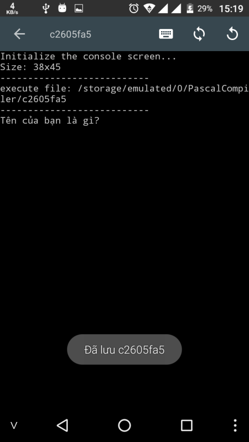
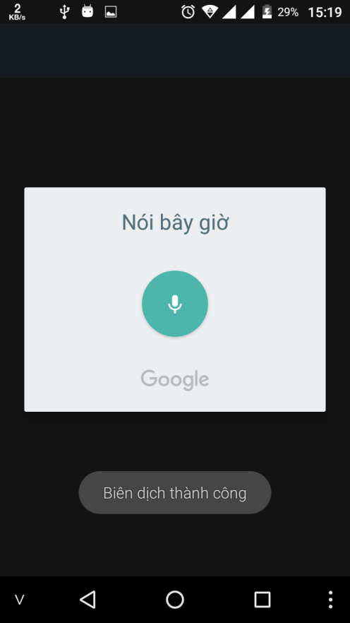

# TẠO ỨNG DỤNG GIAO TIẾP BẰNG GIỌNG NÓI VỚI PASCAL N-IDE

## Mục tiêu

Tạo một ứng dụng có khả năng giao tiếp bằng giọng nói nhờ vào bộ. Ứng dụng sẽ hỏi câu “bạn tên là gì?” và chúng ta sẽ trả lời bằng giọng nói.

## Một số yêu cầu trước khi lập trình

Ứng dụng phải ở phiên bản ``3.6.9`` hoặc cao hơn

Cần có Google Voice, TextToSpeech (2 món này thì Android nào cũng có mà …)

## Giới thiệu về các thư viện

Thư viện ``aTTSpeech``: chuyển văn bản thành giọng nói, sử dụng hàm ``speak('text')`` để đọc một xâu

Thư viện ``aRecognition``: chuyển giọng nói thành văn bản, sử dụng hàm ``speechToText`` để lấy dữ liệu

## Lập trình

Đây là code hoàn chỉnh của ứng dụng, các bạn xem comment code để hiểu nội dụng:

```pascal
uses aTTSpeech, {Thư viện chuyển văn bản thành giọng nói}
    aRecognition; {Thư viện chuyển giọng nói thành văn bản}
var
    name: string; {hỗ trợ UTF-8}
begin
    {In ra màn hình}
    writeln('Tên của bạn là gì? ');

    speak('Tên của bạn là gì');

    {Đợi khoảng vài giây, có thể do điều kiện mạng mà
    ứng dụng sẽ đọc nhanh hay chậm, các bạn điểu chỉnh thời
    gian tạm dừng để được như ý muốn}
    delay(3000);

    name := speechToText;
    {Ứng dụng sẽ hiện lên hộp thoại}

    writeln('Xin chào ' + name);
    speak('Xin chào ' + name);
    delay(3000);

    readln;
    stopSpeak(); {dừng đọc nếu còn đang đọc}
end.
```

## Một số hình ảnh khi chạy ứng dụng




https://youtu.be/dPt2PaF8YQ0