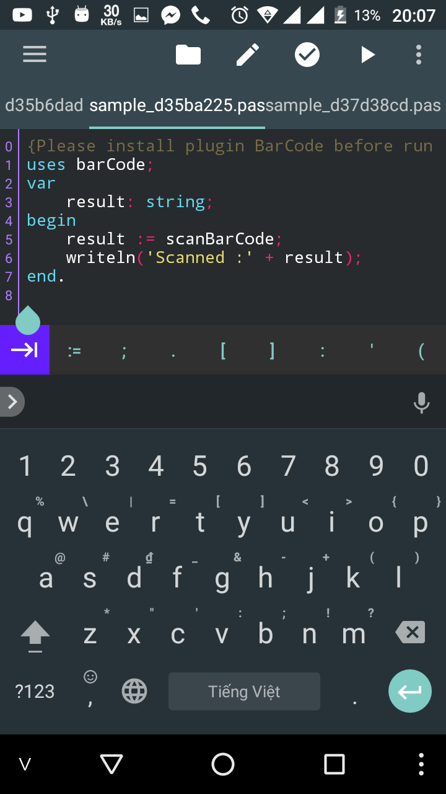
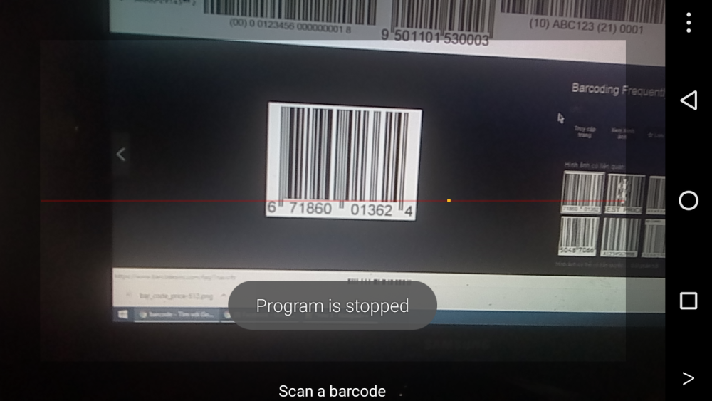
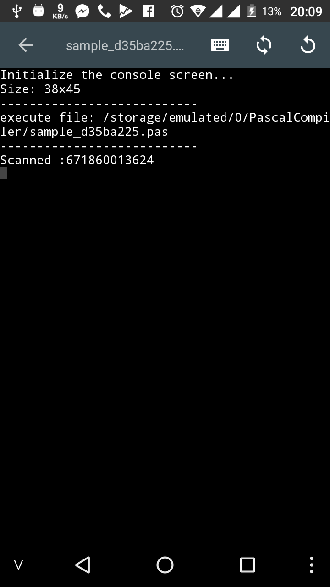

# Scan bar code, QR code

## Đôi nét về barcode (mã vạch)

Mã vạch là sự thể hiện thông tin trong các dạng nhìn thấy trên các bề mặt của sản phẩm, hàng hóa mà máy móc có thể đọc được. … Mã vạch có thể được đọc bởi các thiết bị quét quang học gọi là máy đọc mã vạch hay được quét từ hình ảnh bằng các phần mềm chuyên biệt.

## Một chút về QRcode

QR Code, viết tắt của Quick response code (tạm dịch “Mã phản hồi nhanh”) hay còn gọi là mã vạch ma trận (matrix-barcode) là dạng mã vạch hai chiều (2D) có thể được đọc bởi một máy đọc mã vạch hay smartphone (điện thoại thông minh) có chức năng chụp ảnh (camera) với ứng dụng chuyên biệt để quét mã vạch.

 ma-vach-barcode QR Fulltech

## Lập trình như thế nào?

Một vài lưu ý:

– Phiên bản cần thiết: **Pascal N-IDE** hỗ trợ thư viện ``barCode`` từ phiên bản ``3.7.3`` trở lên.

– Cần khóa xoay màn hình

### Cách import thư viện:
```pascal
uses barCode;
```

### Các hàm được hỗ trợ

```pascal
function scanBarCode: string;
```
Quét mã vạch. Khi gọi hàm này ứng dụng sẽ hiện ra camera để quét mã vạch, sau đó trả về một chuỗi là giá trị của mã vạch vừa quét được, nếu người dùng nhất nút back, hàm sẽ trả về chuỗi rỗng
___
```pascal
functioon scanQRCode: string;
```
Quét mã QR. Khi gọi hàm này ứng dụng sẽ hiện ra camera để quét mã QR, sau đó trả về một chuỗi là giá trị của mã vạch vừa quét được, nếu người dùng nhất nút back, hàm sẽ trả về chuỗi rỗng


### Ví dụ mẫu:
```pascal
uses barCode;
var
   result: string;
begin
   result := scanBarCode;
   writeln(result);
end.
```

### Một vài hình ảnh khi chạy ứng dụng





